### 登陆按钮默认置为disabled，只有手机号和验证码都输入可以点击

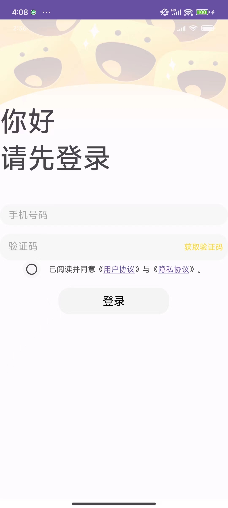

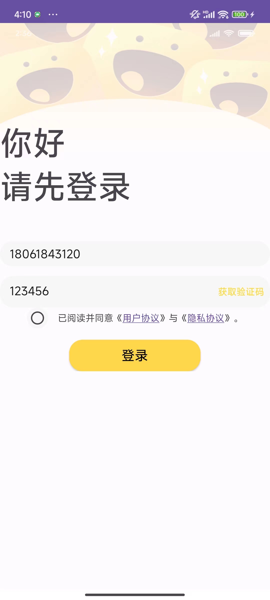

### 这是游戏主界面，点击任意icon可以跳转到对应的详情页

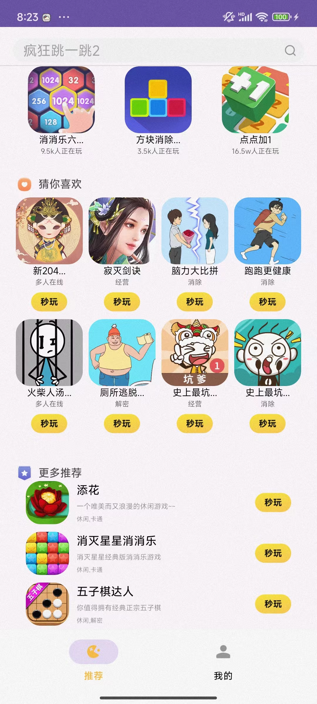

### 这是游戏的详情页，点击上方的返回按钮可以返回到主页，详情页可以滑动到页面最底下

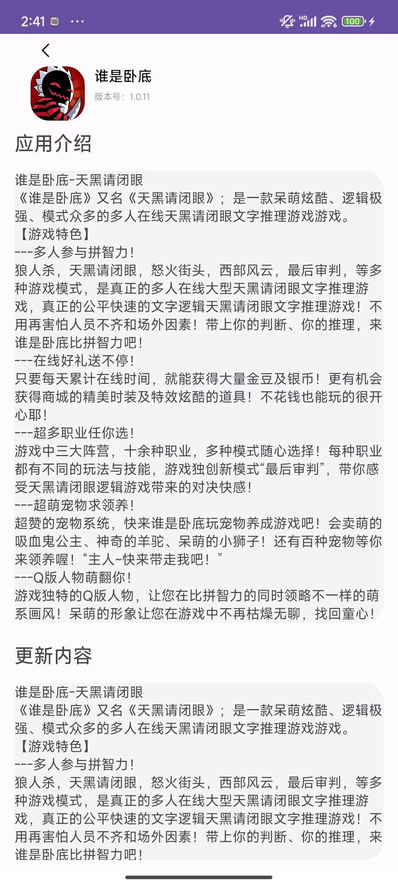

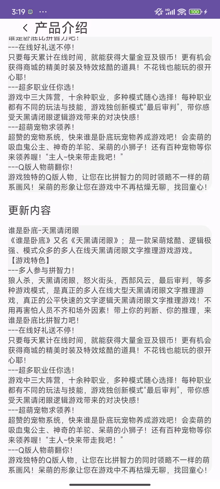

### 这是个人主页，初始为未登录状态，点击”点击登录“，页面跳转到登录页面

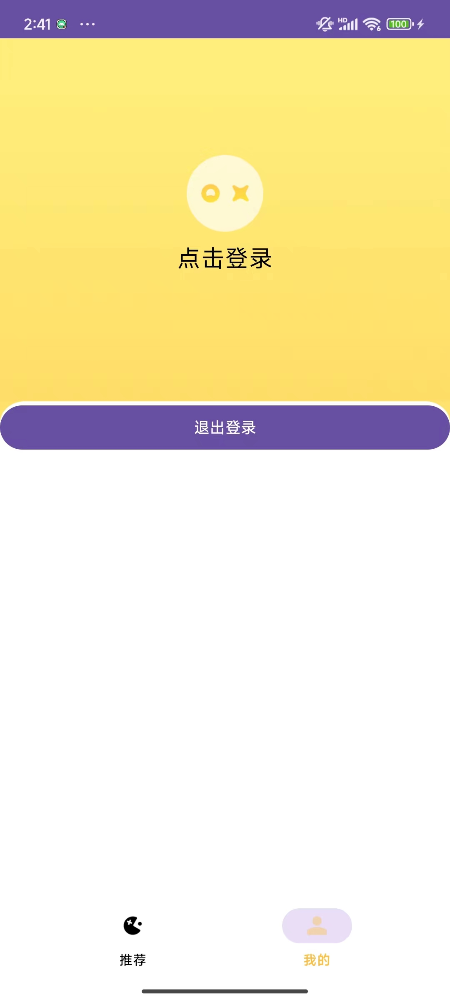

### 这是登陆页面

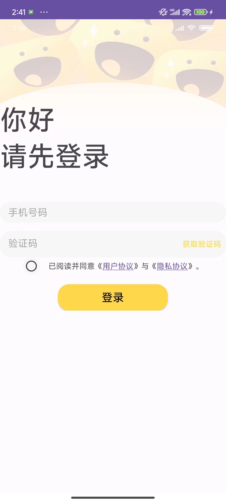

### 点击同意隐私协议才能登陆，否则弹出”先同意隐私协议才可以登录哟~“

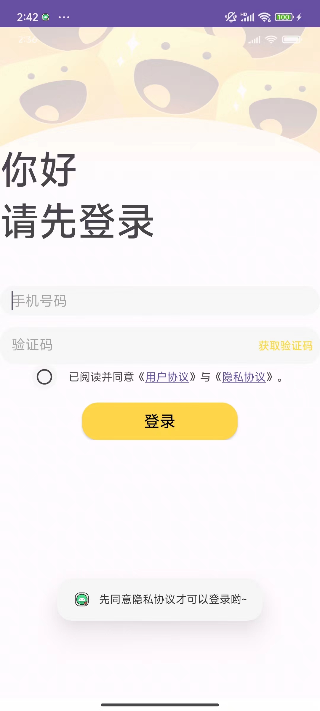

### 手机号输入框设置长度必须为11，且只能输入数字

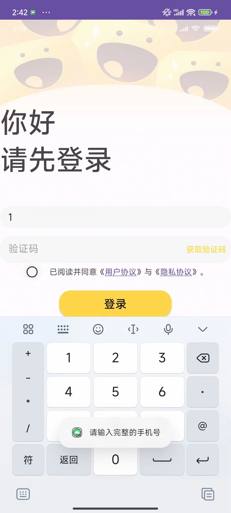

### 手机号输入为11位后，才可以点击发送验证码，验证码点击一次后会有一个倒计时，倒计时结束后才能重新点击

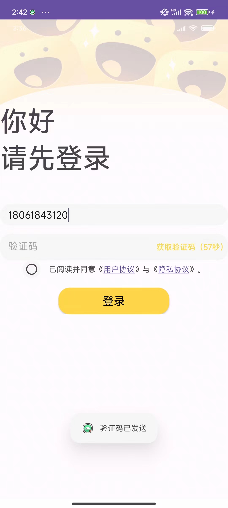

### 用户协议和隐私协议点击后弹出对应的弹框

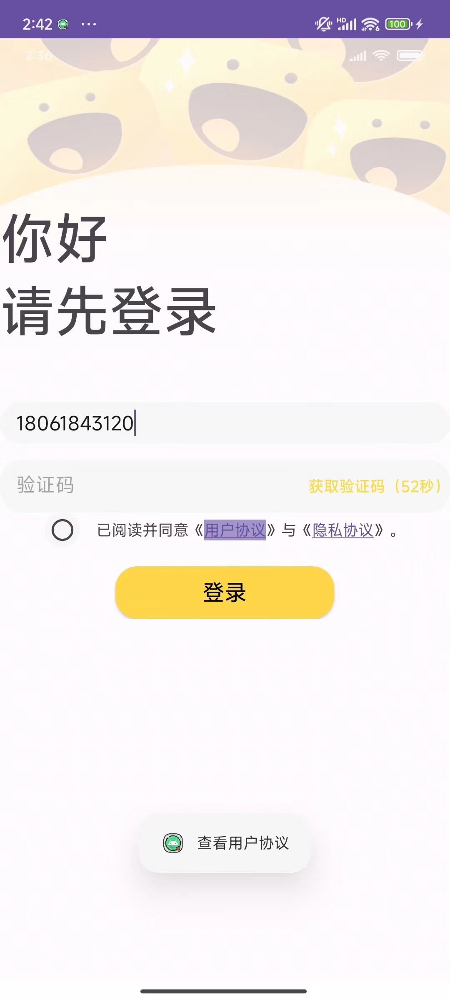

### 输入验证码和选中单选框后就可以登录了（这里为了防止超出限制，设置了code为400时可以登录成功，仅用于演示）

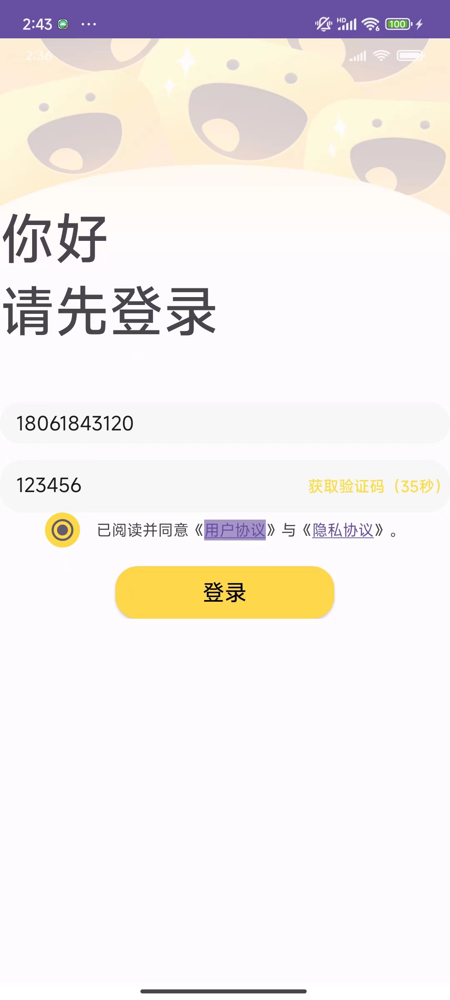

### 这是调用sendCode网络请求后得到的验证码

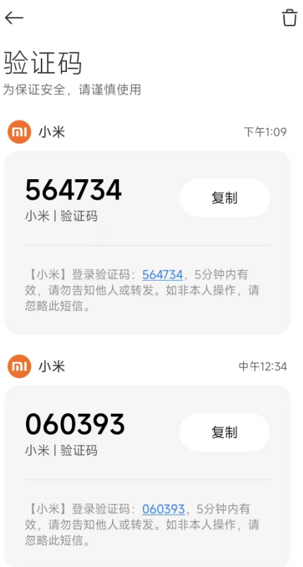

### 登录成功后会跳到主页

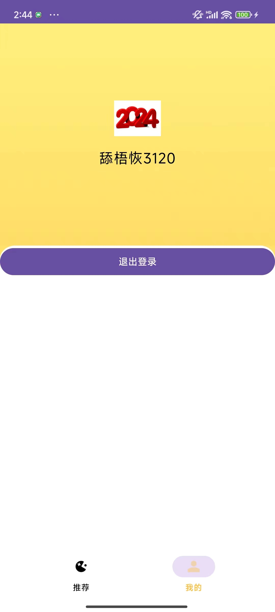

### 主页

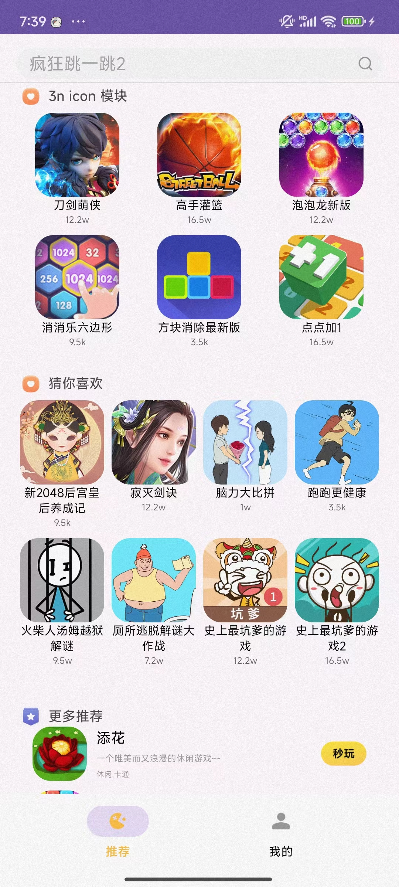

### 断网时，网页缓存第一页数据

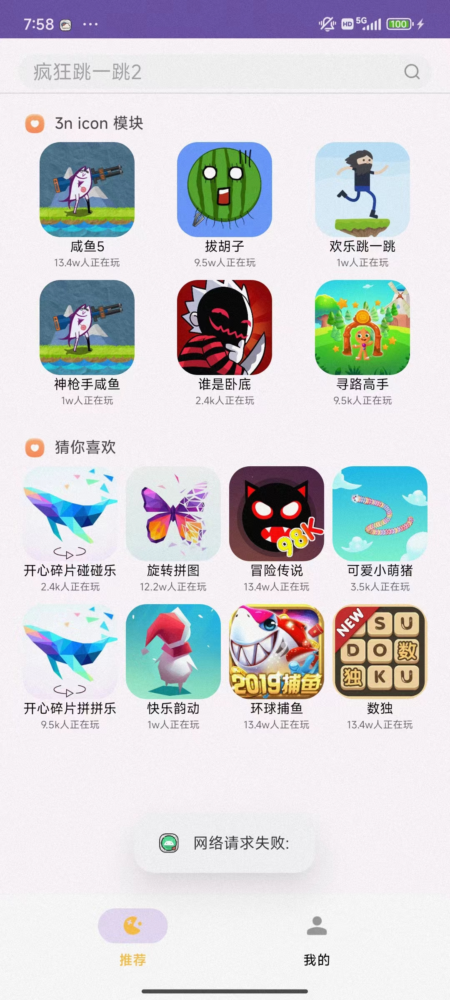

### splash页，经过一秒的动画，弹出声明与条款。点击不同意则退出app

### 点击用户协议和隐私协议，可以弹出相应的Toast

### 点击同意并使用，进入主界面，fragment默认为推荐页

### 推荐页

### 我的主页

### 搜索框点击回车键或者放大镜可以跳转到搜索页
### 默认为显示搜索记录的fragment

### 当前搜索记录为空，所以什么也没有

### 点击搜索按钮或者搜索框按回车，可以显示搜索结果

### 点击任意搜索项，可以跳到对应的详情页

### 回到上级页表，显示了上次的搜索记录

### 点击删除按钮，删除所有的搜索记录，并弹出搜索记录为空

