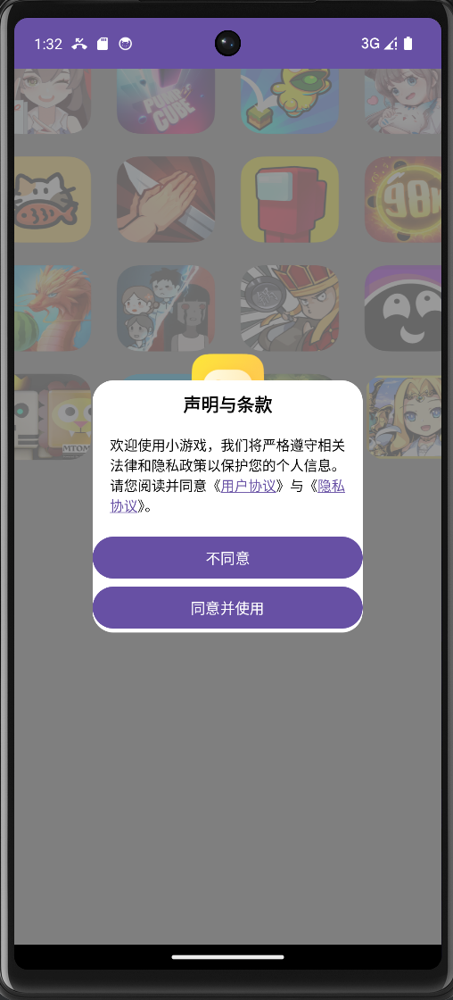
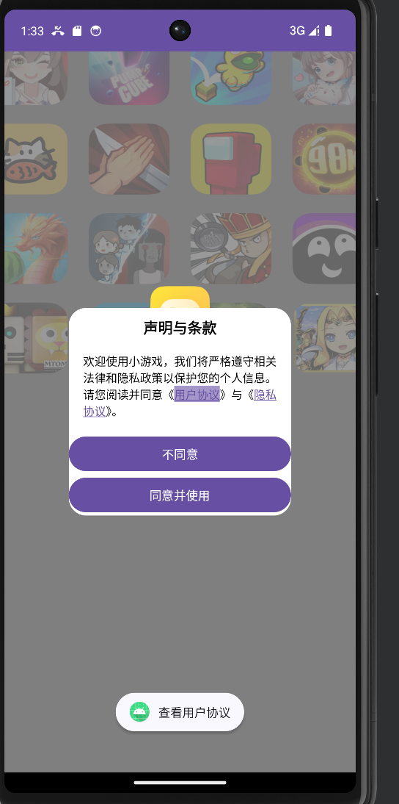
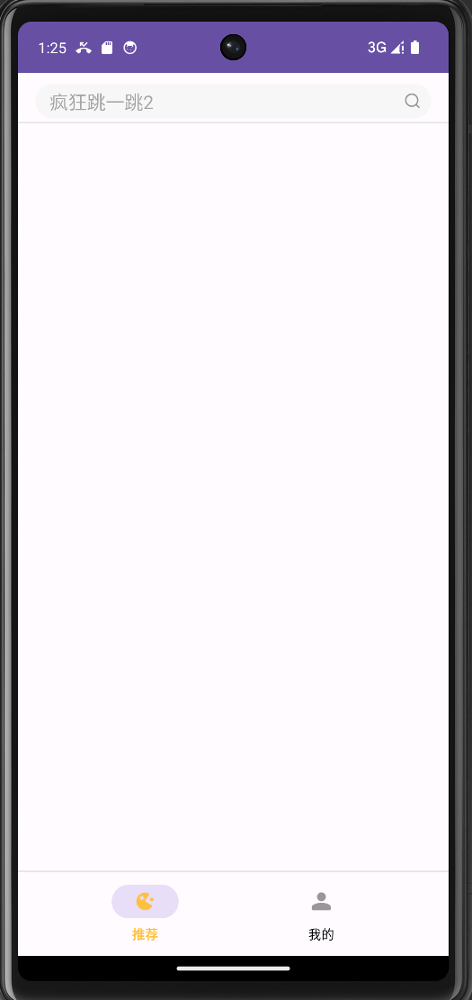
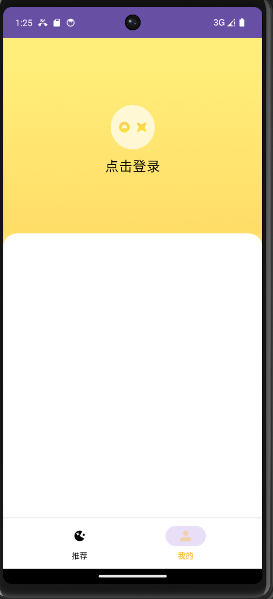
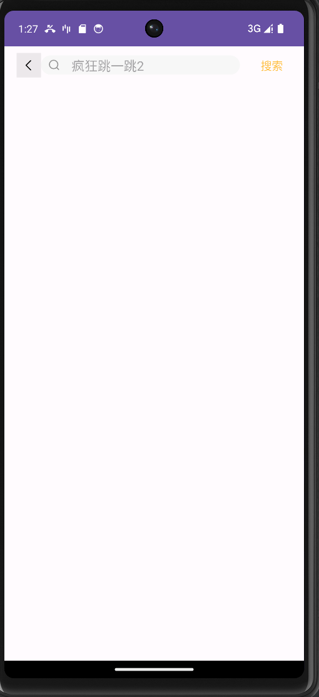
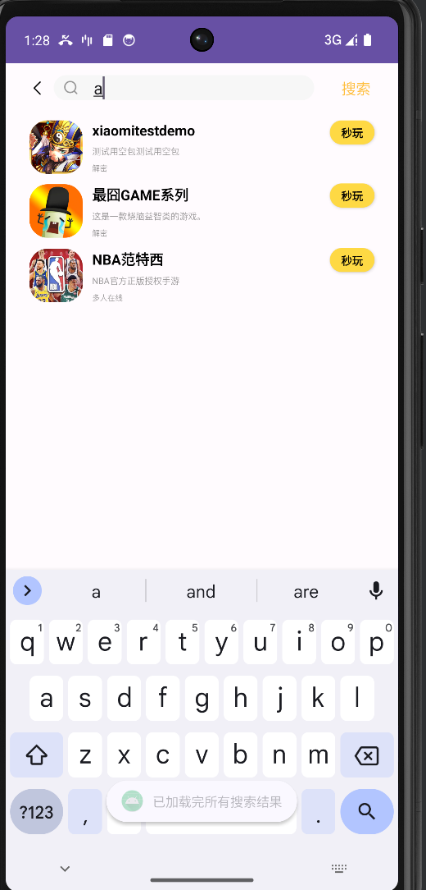
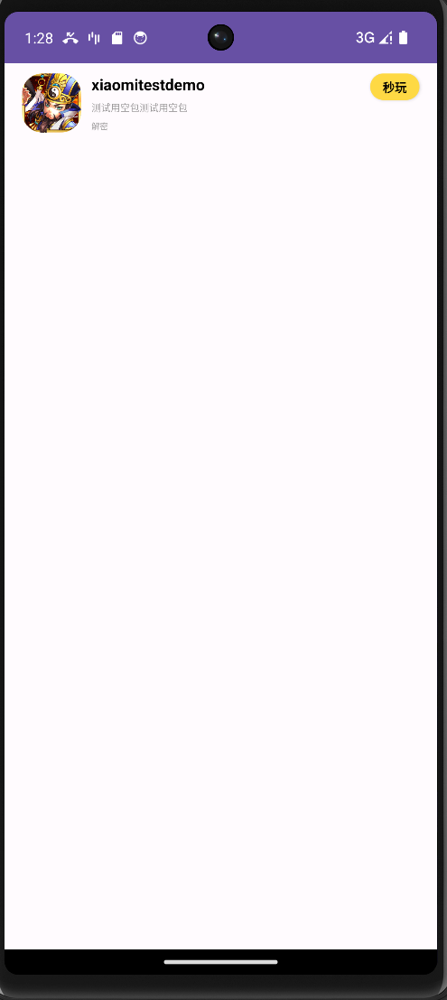
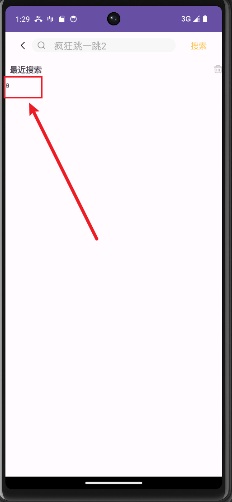
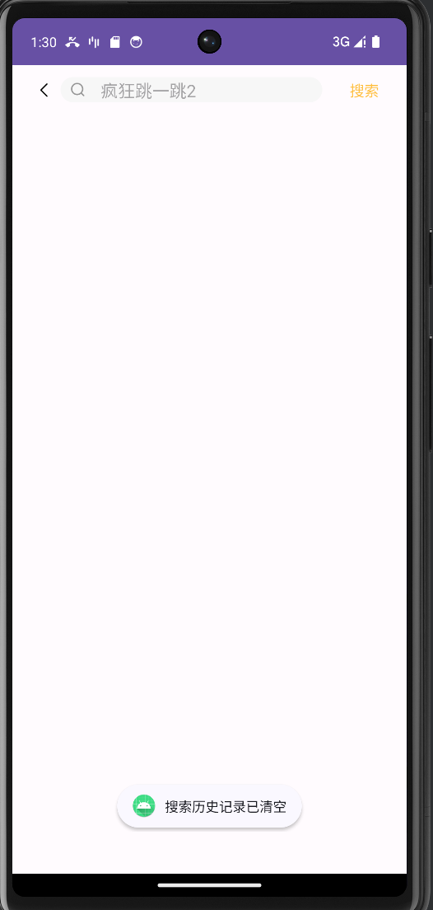

### splash页，经过一秒的动画，弹出声明与条款。点击不同意则退出app

### 点击用户协议和隐私协议，可以弹出相应的Toast

### 点击同意并使用，进入主界面，fragment默认为推荐页

### 推荐页

### 我的主页

### 搜索框点击回车键或者放大镜可以跳转到搜索页
### 默认为显示搜索记录的fragment

### 当前搜索记录为空，所以什么也没有

### 点击搜索按钮或者搜索框按回车，可以显示搜索结果

### 点击任意搜索项，可以跳到对应的详情页

### 回到上级页表，显示了上次的搜索记录

### 点击删除按钮，删除所有的搜索记录，并弹出搜索记录为空

